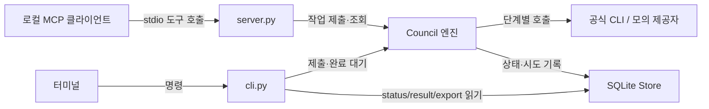
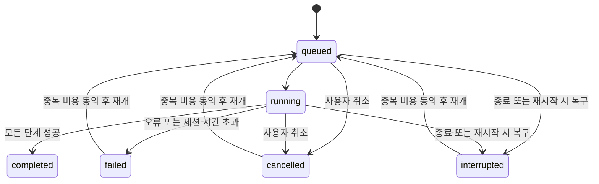

# AI-Council 작업 컨텍스트

확인일: 2026-10-06 (Asia/Seoul). 기능 구현 커밋: `d8e6be4`.
macOS 기본 DB 오류 수정에 이어 채팅방형 로컬 Web UI와 설치형 Buzz ACP bridge를 구현했습니다. 사용자 승인 후 Buzz 에이전트 생성·채널 추가·실제 relay 모의 토론 게시까지 검증했습니다. 이후 사용자 요청으로 실제 Codex·Claude 운영 모드로 전환하고 7회 실제 호출 및 Buzz 답글9건을 검증했습니다. 완료된 프로젝트 변경은 `d8e6be4`에 커밋했습니다. Universal Harness는 사용자 요청에 따라 별도 관리성 커밋으로 기록합니다.

## 커밋 운영 규칙

- 사용자 확정: 앞으로 완료된 작업은 검증 후 작업 단위로 항상 커밋하며 제목·본문은 한국어로 작성합니다. AGENTS.md에 영속화했습니다. 원격 푸시는 별도 요청 시에만 수행합니다.
- Universal Harness 관리성 커밋: 기존 서브모듈 `57819f4`, 설치 상태·실행 도구·Sol 프로필·프로젝트 스킬10개를 함께 기록합니다. 관리 파일19개 해시·실행 권한, Python 문법, JSON 형식 및 `git diff --cached --check` 검증 대상입니다. 설치·업데이트·애플리케이션 실행 코드는 변경하지 않습니다.
- 이번 커밋 작업에서는 `git diff --check`, `git diff --cached --check`를 통과했습니다. 실행 코드는 변경하지 않아 앞선 88개 테스트·빌드·운영 E2E 검증을 재실행하지 않았습니다.

## 현재 작업: Buzz 채팅방 / 모델·추론 설정

- 사용자 확정: Buzz는 `/Applications/Buzz.app` 자체에 연결하는 의미입니다. 설치 버전 0.5.26, bundle `xyz.block.buzz.app`. 공식 소스 `desktop-v0.5.26`(2b4b138dc5cf2d9cc1a0ceb21d9063ff56fe8bf4)을 `/tmp/ai-council-buzz-source`에서 확인했습니다.
- **현재 외부 연동 상태(후속 턴)**: 사용자 지정 relay `wss://sesac-ecommerce01.communities.buzz.xyz`, 채널 **AI Council**, UI에서 확인한 UUID `580f1e42-3eb9-444d-a083-d997e6d86a2b`. Buzz 초기 설정은 완료됐고 해당 채널이 열려 있었습니다. 현재 채널 멤버는 사용자 1명입니다.
- Buzz Settings → Agents → Custom harness에서 `ai-council` 런타임을 실제 저장했습니다. 파일은 `~/Library/Application Support/xyz.block.buzz.app/custom_harnesses/ai-council.json`; 명령은 저장소 `.venv/bin/ai-council`, args는 `buzz-acp --endpoint /Users/unenmac/Desktop/unen/work/00_AI-Council/.council/buzz-endpoint.web.json --channel 580f1e42-3eb9-444d-a083-d997e6d86a2b`. env는 비어 있습니다. 저장 파일과 UI 선택 목록으로 확인했습니다.
- 이전 모의 Web 서버(운영 전환 시 종료): `.venv/bin/python -m ai_council web --demo --database .council/buzz-demo.sqlite3 --port 8767 --endpoint .council/buzz-endpoint.web.json` (이전 exec session36111). 이전8765 미리보기와 별개입니다. 토큰은 이 문서에 기록하지 않습니다.
- **실제 연결 검증 완료**: 사용자가 “승인”한 뒤 준비된 양식에서 에이전트를 생성했습니다. AI-Council이 AI Council 채널에 추가되어 멤버2명으로 표시됐습니다. 하네스AI-Council, Use harness defaults, This computer, Only me, parallelism1입니다. 추가 승인 질문을 반복하지 마세요.
- 2026-10-06 17:23 KST, 사용자가 승인한 모의 검증 질문을 Buzz UI에서 실제 에이전트 멘션으로 전송했습니다. 이벤트 `635453fb1373366ceb11ba43b5046112ce50436406e14722ec98ef3f29137491`, Council 세션 `a8e43d5712b940ffad14b886751011ff` completed. 실제 Buzz 스레드에 시작1+독립의견3+비평3+수정3+종합1+완료1 = **12 replies**를 UI로 확인했습니다. SQLite는 position/critique/revision 각3개와 synthesis1개 모두 succeeded, delivery journal도 complete posts12개입니다. 실제 모델/구독 호출0회, 공개된 내용은 [SIMULATED] 모의 답변입니다.
- **현재 운영 서버**: `.venv/bin/ai-council --config council.toml web --database .council/buzz-live.sqlite3 --port 8767 --endpoint .council/buzz-endpoint.web.json` (exec session65754). 이전 모의DB와 state.sqlite3는 보존했습니다. 운영 프로필은 `buzz-live.web-profile.json`: codex gpt-6-sol/medium + claude sonnet/medium, rounds1, chair codex. 두 제공자의 기존 subscription_confirmed=true와 doctor 로그인·호환성 verified를 확인했습니다. Gemini는 기존 disabled/미동의를 유지했습니다.
- **운영 E2E 완료 2026-10-06 17:38 KST**: Buzz 이벤트 `b9972c1151ff6f653c020db78b129ed1981490997980a2f5b7453afaa803b533`, 세션 `469d463c2463459fa16f5ad9dfb12ed7`. simulated=false, position/critique/revision 각2개+synthesis1개, 실제7호출 모두 succeeded, 실패0. Buzz UI 최종 completed/7회 및 9 replies 확인. 모델별 reported_model은 없으므로 표시값은 요청 모델/effort이며 실제 적용량까지 입증하지 않습니다.
- Buzz 기존 에이전트 설명을 실제 Codex/Claude 운영으로 갱신했고 권한·identity는 변경하지 않았습니다. Web8767 새 토큰으로 인증/프로필/실제 결과를 확인했습니다. 자동 시작 서비스가 아니며 재부팅 뒤 docs/buzz.md 명령을 실행해야 합니다. 서버 재시작 직후 TIME_WAIT로 bind 오류가 있었으나 소켓 해제 후 같은 명령으로 정상 시작했습니다. 로그 `.council/buzz-live-server.log`는 인증 링크를 포함하므로0600이며 공유하지 마세요.
- Buzz의 Customize 모드는 모델을 필수로 요구하므로 이 bridge는 **AI-Council 하네스 선택 후 Use harness defaults 탭으로 전환**해야 합니다. 기본 모델을 허위로 광고하는 코드 변경은 필요하지 않습니다. 실제 relay의 모의 및 실모델 게시 검증을 완료했습니다.
- 설계: Buzz 네이티브 단일 추론 선택기로 여러 LLM을 표현하지 않습니다. `web.py`의 로컬 화면에서 참여자별 모델/추론·라운드·의장을 설정하고, `buzz.py` ACP bridge는 지정 채널의 단일 `/council 질문` 이벤트를 실행·게시합니다. Web 직접 실행은 Buzz 자동 게시 대상이 아닙니다. 완료 답변 단위 1초 polling이며 토큰 스트리밍/내부 사고 과정은 아닙니다.
- 완료 기준: 각 답변 도착 시 관찰, 모든 광고된 모델/effort 보존, 설정 스냅샷, 취소/오류 가시화, 기존 예산·동의·도구 제한·블라인드 장벽 유지. Web은 1개 활성 토론으로 제한하며 실행 중 설정 수정을 거부합니다. 최적화/수동 규칙 우회는 추가하지 않았습니다.
- 새 명령: `ai-council web [--demo] [--database PATH] [--port 8765] [--endpoint PATH] [--open]`, `buzz-config --channel UUID --endpoint PATH`(자격 증명 없는 custom harness JSON 출력), `buzz-acp --channel UUID --endpoint PATH [--buzz-binary PATH]`.
- 보안: loopback 전용, bearer/Host/Origin 검사, 128 KiB 입력 한도, 0600 endpoint/profile, 모델 HTML을 실행하지 않는 textContent UI. Buzz identity는 명시적으로 주입된 BUZZ 환경만 사용하고 모델 CLI에는 전달하지 않습니다. 고정 채널·owner-only 운영, 알림 구문 무력화, same-channel asyncio/flock 잠금, 전송 기록, 실패 시 취소. 외부 게시 직후 receipt 저장 전 crash의 exactly-once는 보장하지 않습니다.
- CLI 설정: `ProviderConfig.reasoning_effort`; Codex `-c model_reasoning_effort=JSON_STRING`, Claude/agy `--effort`. 명시값만 identity에 넣어 기존 None fingerprint와 DB schema1 유지.
- 실제 추론 없는 catalog 검증: Codex model/list 9개(모델별 low/medium/high/xhigh/max/ultra), Claude initialize models 12개(모델별 다름), agy models 14개 변형. agy help는 설명 문구 뒤 `(low|medium|high|xhigh|max)` 형식이며 이를 보존합니다. **agy는 모델별 capability가 없어 CLI 전체 옵션/실지원 미확인을 UI에 표시**합니다. 목록 실패 시 하드코딩 fallback 없음.
- 검증: `.venv/bin/python -m pytest -q --cov=ai_council --cov-fail-under=80` 88통과(최종 coverage81.65%); `.venv/bin/ruff check src tests`, `git diff --check` 통과. 초기 신규 모듈 미구현 테스트 실패 후 구현했고, 실제 agy help 설명 문자열 때문에 catalog 파싱 실패한 경로를 fixture와 함께 수정했습니다.
- 실제 ACP stdio 초기화/세션 및 ASGI observer/auth/취소 테스트 포함. 지연 모의 제공자로 중간 답변 공개와 **아직 critique 미실행**, MCP result sealed 유지, 설정 잠금/중복/취소 검증. 설치된 CLI catalog는 실계정 추론 없이 조회 성공.
- 수동 통합 `.venv/bin/python /tmp/council-buzz-wire-test.py`: 실제 ACP stdio → localhost HTTP → 모의10호출 → fake Buzz CLI12게시 성공, 같은 event 재전달 추가0건. 처음에 Buzz event 기반 idempotency 키가 기존48자 한도를 넘는 오류를 발견해 SHA256 base64url 48자 키로 수정하고 Request 계약 회귀 검증 추가. 실제 Buzz relay 검증으로 취급하지 마세요.
- CUA 브라우저: 모의 토론 10호출/결과/기록 및 실제 catalog UI의 Codex ultra·Claude xhigh 선택 저장 확인. 테스트용 실제 catalog DB는 `/tmp/council-buzz-catalog.sqlite3`이며 구독동의 false 유지, 추론0회. 해당 8766 서버는 검증 후 종료했습니다. 모의 미리보기는 `http://127.0.0.1:8765/`에 열었습니다. endpoint 인증 토큰을 이 문서에 저장하지 않습니다.
- independent review(`/root/review_buzz`)에서 동시 중복 전송/receipt 오류 뒤 취소 누락 P2 2건을 발견해 수정하고 재검토했습니다. 재검토에서 추가 P1/P2 없음. 회귀 검증은 `tests/test_buzz.py`, `tests/test_web.py`.
- 빌드: `.venv/bin/python -m build` 성공, wheel에 static HTML/CSS/JS 포함. 기존 license TOML deprecation은 남습니다. 새 명시적 런타임 의존성 Starlette/Uvicorn/httpx는 기존 MCP 의존 환경에 설치되어 있었으며 사용 버전1.7.0/0.54.0/0.28.1입니다.
- 주요 변경: 신규 capabilities.py/web.py/buzz.py/static, tests/test_capabilities.py/test_web.py/test_buzz.py, cli/config/providers, pyproject, .gitignore, examples/council.toml. 운영 명세는 **docs/buzz.md**, README/docs/architecture.md/docs/providers.md/SECURITY.md, 변경기록 CHANGELOG.md.
- 후속 범위: 현재 Codex/Claude 운영 경로 검증 완료. 모든 모델·추론 조합, 실제 청구액, Gemini 추론, 재부팅 자동 시작은 미검증/미구현입니다. 이번 운영 전환은 코드 변경 없이 설정·런타임·docs/buzz.md/README/CHANGELOG/context만 갱신했습니다. 검증 명령: `.venv/bin/ai-council --config council.toml doctor`, 위 운영 web 명령, 인증 HTTP state/catalog/profile/session 조회 및 Buzz 네이티브 UI 확인, `git diff --check`. 이전88개 테스트 결과를 이번 재실행으로 주장하지 마세요.

## 최근 수정: macOS 데모 실행 실패

- 사용자 명령: `ai-council demo 'Personal State OS에 event sourcing이 필요한가요?'`. 기본 경로의 `~/.local` 및 `~/.local/share`가 root(uid 0) 소유여서 DB 폴더 생성 시 권한 오류가 발생했고, CLI가 이를 `invalid_input`으로 처리했습니다. 임시 DB 경로의 동일 질문은 성공했습니다.
- 해결: 새 macOS 기본 DB는 `~/Library/Application Support/ai-council/`을 사용합니다. 각 기존 legacy DB 파일은 계속 사용하며, Linux/WSL 기본 경로·명시적 경로·DB 스키마는 보존합니다. DB 생성·파일 권한 처리의 `PermissionError`는 `database_permissions`로 구분합니다.
- 완료 기준/필수 제약: 옵션 없는 데모가 10회 모의 호출로 완료되고, 기존 세션과 명시적 경로는 유지되며, 쓰기 불가 경로는 명확히 실패해야 합니다. 소유권 변경·자동 DB 이동·유료 호출은 하지 않습니다. 최적화 알고리즘이나 soft constraint 변경은 없습니다.
- 회귀 시나리오: 쓰기 불가 legacy 부모 + 신규 macOS 데모, macOS/Linux의 실제·모의 기본 경로, 기존 legacy 세션 재사용, 명시적 쓰기 불가 DB 경로입니다. 처음 두 CLI 회귀 테스트가 수정 전에 동일한 `invalid_input`으로 실패하고 수정 후 통과했습니다.

## 현재 상태와 범위

- `pyproject.toml`, `src/ai_council/__init__.py`, README, CHANGELOG의 버전은 **1.0.0**입니다. 로컬 Git 태그는 없습니다.
- 공식 CLI의 기존 구독 로그인을 이용하는 단일 사용자용 로컬 MCP stdio 서버입니다. Python 3.11+, macOS/Linux/WSL을 대상으로 합니다.
- 핵심 의존성은 MCP SDK와 Pydantic입니다. API 라우터·원격 HTTP/OAuth 브리지·계정 공유 서비스는 없습니다. 이번 변경은 로컬 인증 Web UI와 선택적 Buzz ACP 연결을 추가합니다.
- Codex CLI, Claude Code, Antigravity CLI 어댑터와 계정·네트워크 없이 실행하는 `[SIMULATED]` 모의 제공자가 있습니다. 설정 ID `gemini`는 `agy`를 실행하는 Antigravity 어댑터를 가리킵니다.
- 실제 Codex/Claude 계정으로 선택된 모델/추론의 운영 경로를 검증했습니다. 과금 여부, 다중 모델 품질 우위와 현재 CI 결과는 미검증입니다. 로컬 `.venv`는 Python 3.12.4, Pydantic 2.13.5, 저장소 editable 설치입니다.

## 구조: 요청이 어디에서 처리되는가

MCP는 작업 제출 후 즉시 세션 ID를 반환하고 조회 도구로 진행을 확인합니다. CLI 토론은 완료까지 기다립니다. 두 경로 모두 같은 엔진을 사용합니다.

| 책임 | 코드 진입점 |
|---|---|
| 요청·응답 계약, 호출 수 계산 | `src/ai_council/models.py`: `Request`, `SCHEMAS` |
| 명시적 TOML 설정, 기본 제한, 모의 설정 | `src/ai_council/config.py`: `load_settings`, `Settings`, `ProviderConfig` |
| 단계 장벽·동시성·취소·재개 | `src/ai_council/council.py`: `Council` |
| 단계별 프롬프트와 정보 경계 | `src/ai_council/prompts.py`: `packet`, `Prompt.render` |
| 공식 CLI 옵션·인증 점검·응답 파싱 | `src/ai_council/providers.py`: `CLIProvider`, `build_command`, `parse_response` |
| 환경변수 필터·시간/출력 제한·프로세스 그룹 종료 | `src/ai_council/process.py`: `worker_environment`, `run_process` |
| SQLite 저장·멱등성·예산 예약·결과 공개 | `src/ai_council/store.py`: `Store` |
| MCP 도구 9개 / 터미널 명령 | `src/ai_council/server.py`: `create_server`; `src/ai_council/cli.py`: `main`, `run` |

도식 근거: 기준 HEAD의 `create_server`, `cli.run`, `Council._invoke`, `Store`를 직접 읽었습니다.

## 토론 흐름: 어떤 정보가 언제 전달되는가

- `debate/review`: 참여자 2–6개, 비평·수정 1–3회. 성공 시 호출 수는 `N × (1 + 2R) + 1`입니다. 3인/1회는 10회입니다. `ask`는 1인/0회/1호출입니다.
- 독립 답변에는 상대 답변이 없습니다. 모든 단계는 필수 참여자의 호출을 모두 기다리고, 하나라도 실패하면 다음 단계로 진행하지 않습니다.
- 별칭 A/B/C…는 세션 생성 시 무작위로 배정하고 재개에도 유지합니다. 비평은 자신을 제외한 모든 상대를 정확히 한 번씩 대상으로 삼습니다. 완전한 익명성을 보장하지는 않습니다.
- 수정에는 자신의 답변과 자신에게 향한 비평을 전달합니다. 의장에는 익명 최종 답변과 비평 이력을 전달합니다. 의장 기본값은 첫 참여자입니다.
- 자동 재시도, 참여자 축소 종합, 다수결, 유료 API fallback은 없습니다. 기존 CLI/MCP result API는 완료 전 transcript와 별칭을 공개하지 않습니다. 새 인증 Web observer는 사용자 요청에 따라 검증된 중간 답변/별칭을 공개하며 LLM 입력에는 되먹이지 않습니다.
- 응답 JSON 스키마와 제공된 출처 ID의 소속만 검증합니다. 사실·출처의 진위와 confidence의 정확성은 검증하지 않습니다.

도식 근거: `Council._run`, `_phase`, `_validate`, `Store.result`; `tests/test_council.py`의 `test_complete_protocol`, `test_blind_barrier_anonymization_and_sealed_transcript`, `test_invalid_output_fails_closed`.

## 상태·저장·복구: 중단 후 무엇이 남는가

- DB schema version 1, `sessions`와 `invocations` 테이블, SQLite WAL 및 POSIX 단일 writer 잠금입니다. 읽기 클라이언트는 병행할 수 있습니다.
- 시도 예약을 외부 호출 전에 저장합니다. 실패·중단·preflight 실패도 로컬 시도 예산을 소비합니다.
- 멱등성 키는 요청 전체(키 제외)와 제공자 kind/executable/model 및 명시적 reasoning_effort를 묶습니다. 동일 키·동일 입력은 기존 세션을 반환하며, 내용 변경은 충돌입니다.
- 재시작 시 미완료 세션·호출을 `interrupted`로 표시합니다. 자동 재개하지 않습니다. MCP 작업의 수명은 서버 프로세스에 종속됩니다.
- 재개에는 `accept_duplicate_cost=true`가 필요합니다. 성공한 단계 키는 재사용하며 제공자 정체성/모델 변경은 거부합니다. 외부 과금의 exactly-once 보장은 없습니다.

도식 근거: `Council.submit`, `_run`, `cancel`, `resume`, `close`; `Store._initialize`, `existing`, `reserve`, `successful`; 취소·재시작·재개·멱등성 테스트.

## 반드시 유지할 운영 경계

- MCP 입력으로 실행 파일·임의 CLI 옵션을 지정할 수 없습니다. 신뢰하는 로컬 설정만 실행 파일을 선택합니다.
- 설정은 `--config` 또는 `AI_COUNCIL_CONFIG`로 명시합니다. DB 상대 경로는 TOML 위치 기준입니다. 실제 기본 DB와 모의 DB는 구분되고, macOS의 신규 기본 위치는 `~/Library/Application Support/ai-council/`입니다. 기존 `~/.local/share/ai-council/`의 각 DB 파일이 있으면 해당 파일을 계속 선택합니다.
- 기본 제한: 세션 32시도, 설정 제공자 ID별 UTC 하루 100시도, 전체 동시 호출 3개, 활성 세션 2개, 실제 CLI 종류별 동시 호출 1개입니다. 제공자 계정의 실제 잔여량·금액 제한이 아닙니다.
- 기본 호출 300초/세션 1,800초, 프롬프트 120,000자, stdout+stderr 합계 1 MiB입니다. 초과 입력을 몰래 자르지 않습니다.
- 실제 제공자는 `subscription_confirmed=true`가 필요합니다. Codex/Claude는 공식 CLI 상태 명령으로 구독 인증을 점검합니다. Antigravity는 기본 비활성화이고 `allow_inherited_tools=true`도 필요하며 인증 상태는 `unknown`입니다.
- 자격 증명 파일을 직접 읽거나 토큰을 추출하지 않습니다. subprocess는 shell 없이 실행되고 환경변수 allowlist를 적용하지만 공식 CLI는 현재 OS 사용자의 권한·인증 저장소를 사용합니다. 강한 OS 격리는 아닙니다.
- 질문·자료는 선택된 모든 제공자에게 전달되고 SQLite에 평문 저장됩니다. DB 파일은 0600이며 암호화되지 않습니다. 상세 경계는 `SECURITY.md`를 기준으로 합니다.

## 검증 범위와 다음 작업

- 테스트 정의를 확인했습니다: 계약·장벽·익명 비평·출처 ID·예산·멱등성·복구·취소·출력 제한·CLI export·모의 제공자를 사용하는 실제 MCP SDK stdio 왕복.
- CI 설정은 Python 3.11/3.13에서 `ruff check .`, `python -c 'import mcp'`, `python -m pytest -q --cov=ai_council --cov-fail-under=80`, `python -m build`, `ai-council demo --database /tmp/council-ci.sqlite3`를 실행하도록 정의되어 있습니다. CI 성공 여부는 확인하지 않았습니다.
- `.venv/bin/python -m pytest -q tests/test_cli.py -k 'macos_demo_without_database or database_permission_error'`: 수정 전 2실패, 수정 후 2통과.
- `.venv/bin/python -m pytest -q --cov=ai_council --cov-fail-under=80`: 67통과, coverage 84.76%. 실제 MCP SDK stdio 왕복 테스트도 포함됩니다(제공자는 모의).
- `.venv/bin/ruff check src tests`: 통과. `.venv/bin/ruff check .`: 기존 `.universal-harness/module/` 파일의 오류 23건으로 실패했으며 해당 파일은 수정하지 않았습니다.
- `.venv/bin/python -m build`: 격리 환경에서 sdist/wheel 생성 성공. 초기 `--no-isolation` 시도는 로컬 setuptools 누락으로 실패했고, 첫 격리 시도는 sandbox 네트워크 제한으로 실패한 뒤 권한 승인된 빌드에서 성공했습니다. 기존 license TOML 형식의 deprecation 경고는 남아 있습니다.
- `.venv/bin/ai-council demo 'Personal State OS에 event sourcing이 필요한가요?'`: 실제 사용자 기본 경로에 실행해 `completed`, `simulated=true`, `attempts=10` 확인. 기존 editable 설치라 재설치 없이 수정 반영됩니다.
- `git diff --check`, `git diff --no-index --check /dev/null docs/codex-context.md`: 통과. Mermaid는 소스만 작성했으며 별도 렌더링·시각 검증은 수행하지 않았습니다. `doctor`·실제 모델 호출은 수행하지 않았고 Linux/WSL에서 직접 실행한 검증도 없습니다.
- 실계정 검증의 문서상 순서는 `doctor → ask → 2인 debate → 3인 debate`입니다. 실제 진행 시 현재 CLI 옵션·인증·계정 과금 설정을 별도로 확인해야 합니다.
- 다음 코드 변경은 이 문서부터 읽고 관련 모듈·테스트만 추가 확인합니다. 제품 동작을 변경한 뒤 현재 명세(`docs/architecture.md`, 필요 시 `docs/providers.md`/README/SECURITY), 변경 기록(CHANGELOG), 이 컨텍스트를 갱신합니다.

## 작업 트리와 이번 변경

- 작업 시작 시 staged: `.gitmodules`, `.universal-harness/module` 추가. tracked unstaged 변경은 없었습니다.
- 기존 untracked: `AGENTS.md`, `.agents/`, `.universal-harness/`의 bootstrap·설정·도구 파일들. 이 변경들은 기존 작업으로 보존합니다.
- 컨텍스트 파악 작업에서 없었던 `docs/codex-context.md`를 생성했습니다. 후속 버그 수정은 `src/ai_council/config.py`, `src/ai_council/store.py`, `tests/test_cli.py`와 현재 명세 `README.md`, `docs/architecture.md`, 변경 기록 `CHANGELOG.md`를 갱신했습니다.
- 기존 harness 작업은 보존했습니다. commit/tag/push는 수행하지 않았습니다. 현재 알려진 잔여 사항은 harness 전체 lint 오류, build license 경고, 실계정 미검증입니다.
